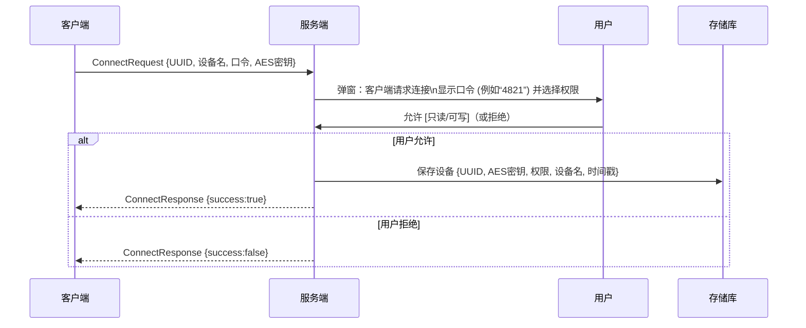
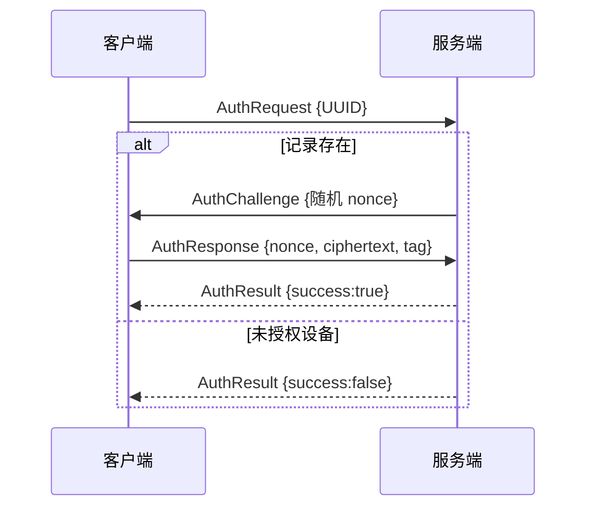

# 首次配对与后续验证协议设计文档

## 执行摘要
本方案定义了客户端与服务端的**首次配对**和**后续连接**协议：客户端首次连接时生成一个四位数字口令和 128 位 AES 密钥，服务端通过弹窗显示口令让用户确认并授权，成功后保存该设备的密钥和权限。之后客户端再次连接时，直接使用已保存的 AES 密钥进行身份验证，所有通信使用 AES-128-GCM 加密传输。文档详细说明了设计目标、消息格式、密钥管理、AES-GCM 使用规范、交互流程、异常处理、安全风险、实现要点和测试方案，便于开发直接参考和实现。

## 设计目标与假设
- **易用性**：采用用户可读的四位随机口令进行人工确认，类似蓝牙配对方式，避免复杂的账号密码体系，提升用户体验。
- **局域网环境**：假设客户端与服务端处于同一局域网，无需通过互联网验证或中继服务器，通信可基于 TCP/IP。
- **多客户端支持**：服务端可同时管理多个客户端设备，每个设备有独立的 AES 密钥和权限设定。即一个服务器实例对应多客户端连接。
- **持久化设备列表**：服务端保存已授权设备信息（设备ID、名称、密钥、权限、授权时间等），断电/重启后仍能识别已有设备。
- **权限控制**：支持不同权限级别（如“只读”、“可读写”、“管理员”），初始设计仅“只读/可写”两级，可预留扩展为更多级别。
- **信任模型**：首次配对过程完全依赖用户在服务端查看口令并确认的信任，无需第三方。假设客户端设备本身安全，服务端用户确认口令可以阻止错误配对。
- **非对称加密留空**：不使用公钥证书等机制，仅依靠共享的对称密钥进行保护和认证；适用于小型局域网环境，无需复杂 PKI 基础设施。

## 消息交换序列图

### 首次配对流程

- **说明**：客户端生成 `UUID`（设备唯一标识）、随机4位 `口令` 和 `AES密钥`，发送 `ConnectRequest` 请求。服务端弹窗提示用户验证口令并选择权限；若用户允许则保存设备信息（含密钥）并返回成功响应，否则返回失败。

### 后续连接认证流程

- **说明**：客户端发起 `AuthRequest` 包含自身 `UUID`。服务端查找对应 AES 密钥后发出随机 `nonce` 挑战；客户端用该密钥对 `nonce` 或包含其的消息进行 AES-GCM 加密，返回密文和认证标签；服务端解密验证成功则返回 `AuthResult{success:true}`。失败路径：若 `UUID` 未在授权列表，则直接返回失败。

## JSON 消息格式规范

所有消息均为 JSON 结构，主要字段说明如下。成功应答消息中 `type:"response"`，而客户端请求消息为 `type:"request"`。消息字段示例如下（示例使用 Base64 编码密钥/密文，实际可用 Hex 或其他约定）：

- **ConnectRequest**（首次配对请求）
  ```json
  {
    "type": "request",
    "cmd": "connect",
    "id": 1,
    "body": {
      "uuid": "client-abc123",      // 客户端唯一ID
      "deviceName": "Office-PC",    // 设备名称
      "pin": "4821",                // 四位数字口令
      "key": "3q2+7w=="             // 128位AES密钥（Base64）
    }
  }
  ```
- **ConnectResponse**（配对应答）
  ```json
  {
    "type": "response",
    "id": 1,
    "success": true,
    "body": {"message": "Authorized"}
  }
  ```
- **AuthRequest**（二次连接认证请求）
  ```json
  {
    "type": "request",
    "cmd": "auth",
    "id": 2,
    "body": {
      "uuid": "client-abc123"
    }
  }
  ```
- **AuthChallenge**（服务器向客户端发出的挑战）
  ```json
  {
    "type": "response",
    "id": 2,
    "body": {
      "nonce": "a3d4h6..."  // 随机生成的12字节IV（Base64）
    }
  }
  ```
- **AuthResponse**（客户端的认证响应）
  ```json
  {
    "type": "request",
    "cmd": "authResp",
    "id": 2,
    "body": {
      "nonce": "a3d4h6...",          // 与挑战中相同的IV
      "ciphertext": "Xz9a+Q==",     // AES-GCM 对数据加密后的密文（Base64）
      "tag": "5Z1X..."               // 16字节认证标签（Base64）
    }
  }
  ```
- **AuthResult**（服务器认证结果）
  ```json
  {
    "type": "response",
    "id": 2,
    "success": true,
    "body": {"message": "Authenticated"}
  }
  ```
- **加密通信格式示例**（后续所有请求/应答均需加密）
  ```json
  {
    "type": "request",
    "cmd": "someCommand",
    "id": 10,
    "body": {
      "nonce": "<Base64 IV>",
      "ciphertext": "<Base64 密文>",
      "tag": "<Base64 认证标签>"
    }
  }
  ```
  - 其中 `body` 的 `nonce`、`ciphertext`、`tag` 分别为 AES-GCM 加密后的 IV、密文和认证标签，保证数据机密性和完整性。`payload`（如实际操作指令）先组装成 JSON 后作为 AES-GCM 的明文加密。

## 密钥与身份管理策略
- **设备身份 (DeviceID)**：客户端生成一个全球唯一的设备标识（如 UUID）作为 `DeviceID`。首次配对请求携带此 ID，服务端以此为键保存该设备记录。
- **AES 密钥生成**：客户端使用安全随机数发生器生成 128-bit AES 密钥（16 字节），并在首次连接时发送给服务端。示例生成（Python）：
  ```python
  import os, base64, uuid, random
  device_id = str(uuid.uuid4())
  aes_key = os.urandom(16)  # 128位密钥
  pin = str(random.randint(0, 9999)).zfill(4)
  ```
- **存储**：服务端在本地安全存储已授权设备信息，例如保存在加密数据库或配置文件中。每条记录字段示例如下：

  | 字段        | 类型    | 含义                   |
  | ----------- | ------- | ---------------------- |
  | DeviceID    | String  | 客户端唯一ID (UUID)     |
  | DeviceName  | String  | 设备显示名称            |
  | AESKey      | String  | 128位AES密钥 (Hex/Base64) |
  | Permission  | Enum    | 权限级别 (只读/可写/管理员) |
  | CreatedAt   | 日期时间 | 首次授权时间            |
  | LastSeen    | 日期时间 | 上次成功连接时间        |

  服务端加载时从持久化存储读取该列表。**注意**：密钥应妥善保护，可存储为加密形式或使用操作系统安全机制。
- **密钥验证**：二次连接时，客户端通过自己的 `DeviceID` 指明身份。服务端查找对应 AES 密钥后，用该密钥验证客户端发送的加密消息。如 AES 密钥不匹配或设备未授权，认证失败。
- **密钥轮换与撤销**：当前设计密钥长期有效（除非删除设备）。若需轮换，可设计在应用层替换存储的 AES 密钥，或者在特定时间要求重新配对。撤销授权时，只需在设备列表中删除该 `DeviceID` 条目，客户端将无法通过验证。对于关键设备，可设置管理员“重置”功能强制重新配对。
- **二次验证凭证**：这里将 AES-128 密钥作为客户端的“身份凭证”。服务端不存储客户端其它秘密，认证完全基于对称密钥：客户端知晓并使用密钥，服务端验证其合法性。

## AES-GCM 使用细节
- **密钥/IV 长度**：采用 AES-128-GCM，即密钥长度 128 位 (16 字节)。推荐使用 96 位 (12 字节) 随机 IV（nonce），认证标签长度为 128 位 (16 字节)。
- **唯一性与重放防护**：每条消息必须使用唯一的 IV，否则安全性将彻底丧失。建议客户端为每次发送生成新的随机 12 字节 IV，并可在消息中记录单调递增的计数或时间戳作为附加认证数据 (AAD)。服务端应跟踪已接受的 IV/计数，防止重放。
- **附加认证数据 (AAD)**：可将消息的 `type`、`id` 等字段作为 AAD 包含到认证中，以确保它们完整且与密文绑定。AAGCM 在加密时对 (IV, AAD, 密文) 进行认证，可选置为 `null`。
- **认证标签**：采用 16 字节标签，无需修改，确保完整性。AES-GCM 在解密时自动验证标签，标签不匹配即判为篡改或密钥错误。
- **使用限制**：根据 NIST 推荐，随机 IV 模式下，单密钥最多安全加密约 $2^{32}$ 条消息（约 43 亿条），以将发生 IV 冲突的概率控制在 $2^{-32}$ 以内。用户应保证单次项目运行内消息量远小于此限制，或定期更新密钥。单条消息最大明文长度约为 $2^{36}-31$ 字节（约68GB），此限制一般足够。
- **示例**：Python 使用 [Cryptography](https://cryptography.io/) 库示例：
  ```python
  from cryptography.hazmat.primitives.ciphers.aead import AESGCM

  aes_key = b'...16 bytes key...'
  aesgcm = AESGCM(aes_key)
  iv = os.urandom(12)  # 12字节随机IV
  plaintext = b"message payload"
  ciphertext = aesgcm.encrypt(iv, plaintext, aad=None)
  # ciphertext 包含 密文||16字节标签，可分割返回
  ```

## 会话建立与认证流程
1. **首次配对**：如上所述，客户端发起 ConnectRequest，服务端用户确认后保存信息并回复成功。完成后客户端可将 AES 密钥和 `DeviceID` 保存在本地，以便后续连接使用。
2. **后续连接（直接用密钥验证）**：客户端再次连接时，先发送 AuthRequest 包含自身 `DeviceID`。服务端查找对应 AES 密钥后，直接进入认证阶段（可选挑战也可省略）：
   - **直接验证方案**（符合用户要求）：客户端生成一个随机 `nonce`，使用预共享 AES 密钥对该 `nonce`（或包括设备ID的固定消息）进行加密，形成 `ciphertext` 和 `tag`，然后将 `nonce`、`ciphertext`、`tag` 发送给服务端。服务端用同一密钥解密验证标签；若成功，则认为客户端身份合法，返回成功应答。
   - **挑战-响应可选方案**：提高安全性的可选方案，先由服务端发起随机挑战 nonce，客户端返回加密结果后验证。这种方案可避免客户端擅自发送数据，但对本地网络而言不是必需。
3. **建立加密会话**：身份验证通过后，后续所有通信均采用双方已知的 AES 密钥进行 AES-GCM 加密。每个消息都使用新的随机 IV，并按照前述格式发送和接收。
4. **错误流程**：如验证失败，服务端返回失败状态，连接被拒绝；客户端应提示错误并可能放弃自动重连。

## 服务端 UI/交互规范
- **连接请求弹窗**：服务端弹窗标题例如“新客户端请求连接”，内容显示 **客户端名称/IP**，以及显示的 **随机口令**（例如“4821”），并提供权限选择界面。示例文字：“客户端 ‘Office-PC’ 请求连接。匹配口令：**4821**。请选择权限： [只读] [可写]”。弹窗按钮：**允许**、**拒绝**。
- **权限枚举**：建议使用枚举类型，初期可定义为
  - `ReadOnly`（只读）：客户端只能查看数据，不允许修改。
  - `ReadWrite`（可写）：客户端可查看并编辑数据。
  - `Admin`（管理员，可选）：同`ReadWrite`但拥有额外管理权限，如删除其他设备。
  
  | 权限      | 说明                            |
  |---------|---------------------------------|
  | 只读     | 只能读取当前数据，无写权限             |
  | 可写     | 允许读取并修改数据                  |
  | 管理员   | 完全访问权限，可修改权限和设备列表等      |

- **设备列表管理界面**：服务端应提供“已授权设备”列表，包含以下字段：  
  - **设备名称 (DeviceName)**：用户自定义的设备名称。  
  - **设备ID (UUID)**：设备唯一标识，可隐藏或显示前缀。  
  - **权限 (Permission)**：只读/可写/管理员。  
  - **首次授权时间 (CreatedAt)**：该设备被添加的时间。  
  - **上次连接 (LastSeen)**：该设备最近一次成功连接时间。  
  - **操作**：可包括“删除设备”、“修改权限”、“重命名设备”等按钮。
  
  示例表格：  

  | 设备名称      | 设备ID (前缀)     | 权限   | 首次授权        | 上次连接        | 操作           |
  | ------------- | ---------------- | ------ | -------------- | -------------- | -------------- |
  | 办公室电脑     | 3fa85f...        | 可写   | 2026-08-01 10:23 | 2026-08-05 15:42 | [删除][改权限]  |
  | 客厅平板      | a1b2c3...        | 只读   | 2026-08-02 11:00 | 2026-08-04 09:10 | [删除][改权限]  |

- **交互流程**：当服务端接收到 ConnectRequest 时，弹窗应阻塞当前操作，待用户选择“允许”或“拒绝”。若拒绝或超时未操作，应发送失败响应。授权后可提示“授权成功”并更新设备列表。

## 错误处理与异常场景
- **网络异常**：若连接中断或超时，客户端应适当重试或报错。服务端在处理请求时应捕捉异常，断开无效连接。
- **口令错误**：客户端发送的四位口令由服务端通过用户确认，人为错误不会形成技术上的校验，实际效果相当于用户拒绝。可在一段时间后重试配对。
- **密钥不匹配**：后续连接时若 AES 密钥不正确（或用户删除了设备），解密或认证失败，服务端应返回失败响应。客户端应提示“设备未授权或密钥错误”并中止操作。
- **并发连接**：若同一时间多个客户端连接，服务端应并发处理各自的验证流程。可以允许一个设备同时建立多个会话（视需求决定），也可限制同一 DeviceID 只允许单连接。
- **重复配对**：若已存在相同 DeviceID 的记录，再次发送 ConnectRequest 可被视为更新请求；可选择提示“设备已授权，是否覆盖旧授权？”或直接拒绝配对。
- **密钥泄露**：若发现某设备密钥泄露，可在列表中“删除”该设备，随后该设备的连接请求全部拒绝。必要时管理员可重置整个项目数据库密钥（如用于数据库加密的主密钥），以防潜在风险。
- **消息格式错误**：任何格式不符或标签认证失败的消息应立即舍弃并断开连接，以防攻击者发送恶意内容。

## 安全注意事项与已知风险
- **对称密钥无完美前向安全**：使用长期相同 AES-128 密钥意味着如果攻击者获得该密钥，就可解密所有过去和将来通信。建议对重要环境定期更新密钥，或考虑使用 Master/Session 密钥设计（见可选扩展）。
- **Nonce 重用风险**：任何一次重复使用同一 IV 将导致安全崩溃。必须确保 IV 绝不重复，否则可能导致密钥泄露。随机 IV 模式下应遵循最大消息数限制。
- **重放攻击**：需防护重放。如前述可在 AAD 中加入递增序号或时间戳，服务端拒绝接受旧的序号或明显延迟消息。断开后客户端再次握手时不使用旧 nonce。
- **口令安全性有限**：四位口令仅用于人为比对，理论上有 10^4 种组合。虽然可防止误连接，但不应依赖其强度作凭证。攻击者无法在线猜测口令，只需通过物理观察，因而在开放场所可能被冒名配对的风险增加。可通过口令错多次后禁止配对来减轻。
- **中间人攻击**：初次配对过程中若网络被中间人截获并修改消息（如替换公钥或密钥），可能导致后续安全性下降。由于本协议假设在可信局域网内，并靠用户确认口令，所以风险相对可控。强调在陌生网络环境下慎用。
- **其他注意**：使用 AES-128-GCM 时务必使用成熟库实现，避免自写加密代码；确保服务端时间同步（若使用时间戳防重放）；客户端和服务端需维护时钟或计数一致性。

## 开发实现要点与伪代码

### 客户端伪代码示例（Python 风格）
```python
import os, uuid, random, base64, json, socket
from Crypto.Cipher import AES

# 第一次连接，生成设备ID、口令和密钥
device_id = str(uuid.uuid4())
aes_key = os.urandom(16)  # 128-bit 密钥
pin = str(random.randint(0, 9999)).zfill(4)
connect_req = {
    "type": "request", "cmd": "connect", "id": 1,
    "body": {
        "uuid": device_id,
        "deviceName": "Office-PC",
        "pin": pin,
        "key": base64.b64encode(aes_key).decode()
    }
}
sock.send(json.dumps(connect_req).encode())
resp = json.loads(sock.recv(1024))
if resp.get("success"):
    save_to_local("device_info.json", {"uuid": device_id, "aes_key": base64.b64encode(aes_key).decode()})
```

### 服务端伪代码示例
```python
def handle_connect(message):
    body = message["body"]
    uuid = body["uuid"]
    pin = body["pin"]
    aes_key = base64.b64decode(body["key"])
    # 弹窗询问用户
    user_choice, permission = show_confirmation_dialog(device_name=body["deviceName"], pin=pin)
    if user_choice == "allow":
        save_device(uuid=uuid, key=aes_key, name=body["deviceName"], permission=permission)
        return {"type":"response", "id": message["id"], "success": True}
    else:
        return {"type":"response", "id": message["id"], "success": False}

def handle_auth_request(message):
    uuid = message["body"]["uuid"]
    if not device_exists(uuid):
        return {"type":"response", "id": message["id"], "success": False}
    # 查找到密钥后发起Challenge
    nonce = os.urandom(12)
    send_to_client({"type":"response","id":message["id"],"body":{"nonce": base64.b64encode(nonce).decode()}})
    # 接收客户端的AuthResponse
    auth_resp = recv_from_client()
    client_nonce = base64.b64decode(auth_resp["body"]["nonce"])
    ciphertext = base64.b64decode(auth_resp["body"]["ciphertext"])
    tag = base64.b64decode(auth_resp["body"]["tag"])
    key = get_device_key(uuid)
    aesgcm = AES.new(key, AES.MODE_GCM, nonce=nonce)
    try:
        plaintext = aesgcm.decrypt_and_verify(ciphertext, tag)
        return {"type":"response","id": auth_resp["id"], "success": True}
    except ValueError:
        return {"type":"response","id": auth_resp["id"], "success": False}
```
- 其中 `save_device()` 保存记录到数据库或文件，`show_confirmation_dialog()` 用于弹窗和权限选择。AES 加解密可使用标准库（如 Python 的 `pycryptodome`、Java `Cipher`、.NET `AesGcm` 等）。

### AES-GCM 加密/解密示例
```python
from cryptography.hazmat.primitives.ciphers.aead import AESGCM

def encrypt_aes_gcm(key, plaintext):
    iv = os.urandom(12)
    aesgcm = AESGCM(key)
    ciphertext = aesgcm.encrypt(iv, plaintext.encode(), aad=None)
    # ciphertext 包括 tag，实际可分离输出
    return iv, ciphertext[:-16], ciphertext[-16:]

def decrypt_aes_gcm(key, iv, ciphertext, tag):
    aesgcm = AESGCM(key)
    return aesgcm.decrypt(iv, ciphertext + tag, aad=None).decode()
```

## 测试用例与验收标准

1. **配对流程测试**：客户端发起首次配对，请求服务端弹出口令，用户允许后检查服务端设备列表是否新增记录，客户端应收到 `{success:true}` 响应，并在本地保存密钥。用户拒绝配对时应收到 `{success:false}`，且不新增记录。
2. **权限验证测试**：为设备设置“只读”权限后，客户端只能执行读取操作，尝试写操作应被服务端拒绝（返回错误）。设置“可写”权限的设备应能正常读写数据。
3. **二次连接测试**：授权后的设备再次发起连接，确保身份验证通过（返回 `{success:true}`），且后续消息被 AES-GCM 正确加密传输。更改客户端 AES 密钥后再次连接应失败。
4. **并发连接测试**：同时多个客户端连接服务端，确保各自的配对和认证互不干扰。删除一个设备后，该设备连接被拒绝，其他设备不受影响。
5. **错误场景测试**：
   - 模拟网络断开（中途断开握手），客户端应提示连接失败，服务端不应写入数据。
   - 使用错误的 PIN 和 AES 密钥尝试配对和认证，应失败并记录日志。
   - 发送格式错误的 JSON 或伪造标签的消息应被服务端拒绝且不中断其他连接。
6. **安全性测试**：
   - **重放攻击**：记录一次合法消息的 `nonce+ciphertext+tag`，重复发送，应被服务端拒绝（设计中可通过检测已见 nonce 实现）。
   - **Nonce 测试**：确保随机数发生器每次生成不同的 IV，统计冲突概率低。
   - **压力测试**：大量快速发送消息测试是否有 IV 重用风险，同时验证不超过 2^32 消息的限制。
   - **互操作测试**：若使用不同语言或平台实现，验证客户端和服务端可以互相解密验证。

所有测试用例的预期结果和日志应记录齐全，符合业务和安全要求即验收通过。

## 可选扩展
- **主密钥+会话密钥**：当前方案使用静态 AES 密钥。可引入 MasterKey/SessionKey 模式：首次配对后保存一个主密钥，每次连接时客户端生成会话密钥（或服务端派发随机数生成），两者协商得到临时会话密钥用于本次通信，增强前向安全。
- **证书/公钥机制**：替代对称密钥，可用非对称加密或证书验证客户端身份。例如使用 TLS 证书双向认证或客户端私钥签名挑战，避免密钥泄露风险，但增加实现复杂度。
- **互联网中继支持**：当前假设局域网内直连。如需跨网，可设计中继服务器或使用 NAT 穿透技术，使异地客户端也能安全连接，需增加额外认证环节和加密通道。
- **多用户和角色控制**：未来可引入用户账号系统，不同登录用户对设备列表有不同操作权限；或支持更细粒度的访问控制列表 (ACL)。
- **更强加密模式**：考虑使用 AES-GCM-SIV 或 ChaCha20-Poly1305 等模式增强随机 nonce 复用情况下的安全性，尤其在高频率消息场景下使用。
- **多项目/多数据库支持**：当前每个项目独立数据库，未来可扩展为多项目支持以及跨项目访问控制。

**参考资料**：本设计参照 NIST SP800-38D、RFC 5116 等标准以及通用加密实践和相关技术文档。